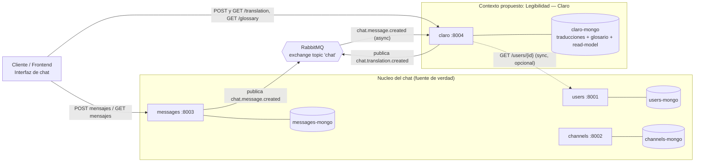

# Propuesta de capacidad vertical: **Claro** — traducción de lenguaje técnico a lenguaje llano

> Capacidad vertical sobre el chat base (Unidad 3). Se mantiene igual en las entregas de las Unidades 4–9.
> Contexto acotado propio: **Legibilidad**. Nombre de producto/servicio: **Claro** *(el grupo puede renombrarlo)*.

---

## 1. Problema de usuario y contexto

En un chat técnico (equipos de desarrollo, soporte, canales académicos) conviven perfiles con niveles de conocimiento muy distintos. Los mensajes se llenan de jerga, siglas, códigos de error y trazas: *"el pod quedó en `CrashLoopBackOff` por un `OOMKilled`, hay que subir el memory limit del deployment"*.

Para un desarrollador senior eso es claro; para una persona de negocio, un cliente, un alumno nuevo o un PM, es una barrera. Las consecuencias típicas son:

- Preguntas repetidas del tipo *"¿qué significa eso?"* que interrumpen al equipo.
- Personas que quedan fuera de la conversación y toman decisiones sin entender el contexto.
- Onboarding lento: quien recién llega no sigue el hilo.

**La capacidad:** cualquier persona puede pedir —o recibir automáticamente— una **versión en lenguaje llano** de un mensaje técnico, más un **glosario** de los términos detectados, sin sacar a nadie del chat y sin modificar el mensaje original.

**Por qué es una capacidad *vertical* y no solo una feature de UI:** vive en su propio contexto acotado, con su propio modelo de datos y ciclo de vida, se integra por eventos y expone su propia API. Puede crecer a lo largo de las unidades (broker real, resiliencia, cacheo, niveles de audiencia) sin tocar el núcleo.

---

## 2. Lenguaje ubicuo y frontera de responsabilidad

### Lenguaje ubicuo (propio del contexto *Legibilidad*)

| Término | Definición dentro de este contexto |
|---|---|
| **Mensaje fuente** | El mensaje original del núcleo. Entrada **de solo lectura e inmutable**. No es propiedad de este contexto: solo se referencia por `message_id`. |
| **Traducción** | Versión en lenguaje llano de un mensaje fuente. Artefacto **derivado e inmutable**, propiedad de este contexto, asociado a un `message_id`. |
| **Término técnico** | Palabra, sigla o código detectado como jerga dentro de un mensaje fuente. |
| **Glosario** | Colección de términos técnicos con su explicación llana. |
| **Explicación** | Texto en lenguaje llano resultante de la traducción. |
| **Nivel de audiencia (registro)** | Grado de simplificación pedido: p. ej. `negocio`, `novato`, `sin-tecnicismos`. |
| **Read-model de mensajes** | Copia local mínima (`id, channel_id, author_id, content, created_at`) que este contexto construye desde los eventos del núcleo para trabajar sin acceder a sus datos. |

### Frontera de responsabilidad frente al núcleo

- El **núcleo (chat)** es la única fuente de verdad de identidad y mensajería. Es dueño de `users`, `channels` y `messages`.
- El contexto **Legibilidad** es dueño de **Traducción** y **Glosario**. **Nunca** crea, edita ni borra usuarios, canales ni mensajes; solo los referencia por `id`.
- **Traducir un mensaje no cambia el mensaje.** La traducción es una *proyección* aguas abajo. Si el mensaje fuente no existe o cambiara, gestionar esa inconsistencia es responsabilidad de este contexto, no del núcleo.
- **Anti-corruption layer:** el payload del evento del núcleo se mapea al modelo propio (read-model). Este contexto no se acopla a estructuras internas ni a la base de datos de nadie: usa **exclusivamente los contratos publicados**.

---

## 3. Diagrama de arquitectura

**Cómo se integra en el `docker-compose`:** se agrega un servicio `claro` (imagen propia) y un `claro-mongodb` con su volumen, ambos en la red `microsvcs`, mapeando el puerto host `8004:8000`. No comparte base de datos con ningún servicio del núcleo.

---

## 4. APIs y eventos: contratos y patrón de comunicación

### 4.1 Lo que **consume** del núcleo

| Contrato del núcleo | Tipo | Patrón de comunicación | Uso |
|---|---|---|---|
| **Evento `chat.message.created`** (exchange topic `chat`, routing key = tipo de evento) | Evento entrante | **Pub/Sub asíncrono (event-driven)** — *integración principal* | Alimentar el read-model y, si el modo es automático, disparar la traducción. Es *event-carried state transfer*: el payload trae el `content`, así que no hace falta volver a pedirlo. |
| `GET /api/v1/users/{user_id}` (`users`) | API REST | **Request/Response síncrono** — *enriquecimiento opcional* | Resolver `display_name` del autor para mostrarlo junto a la traducción. |

> **Decisión de diseño clave:** como el núcleo **no ofrece `GET /messages/{id}`**, el servicio **no** intenta "ir a buscar" mensajes sueltos. Construye su read-model desde el evento. Esto respeta la frontera y evita acoplarse a `GET /channels/{id}/messages` (que obligaría a conocer el canal y a paginar). El evento es la fuente; el REST síncrono queda solo para enriquecer.

### 4.2 Lo que **expone y publica** (contratos propios)

| Contrato propio | Tipo | Patrón de comunicación | Uso |
|---|---|---|---|
| `POST /api/v1/messages/{message_id}/translation` `{audience_level?}` | API REST propia | **Request/Response síncrono** | Traducir on-demand un mensaje ya conocido por el read-model. |
| `GET /api/v1/messages/{message_id}/translation` | API REST propia | **Request/Response síncrono** | Obtener la traducción almacenada (para el botón "Explícamelo en simple"). |
| `GET /api/v1/glossary` y `GET /api/v1/glossary/{term}` | API REST propia | **Request/Response síncrono** | Listar términos técnicos y su explicación llana (tooltips). |
| **Evento `chat.translation.created`** `{translation_id, message_id, channel_id, audience_level, terms[]}` | Evento saliente | **Pub/Sub asíncrono** (mismo exchange `chat`) | Avisar que existe una traducción. Lo puede consumir el ejemplo transversal de **notificaciones**. |
| `GET /health` y `GET /api/v1/events` | API REST | Síncrono | Convenciones de la base (health-check y exploración local del contrato de eventos). |

**Resumen de patrones:** integración de entrada = **asíncrona por eventos** (desacopla del núcleo); consultas de usuario = **síncronas REST** (respuesta inmediata que la UI necesita); salida hacia otros contextos = **asíncrona por eventos** (para que notificaciones u otros no dependan de este servicio).

---

## 5. Flujo de usuario de punta a punta (demostrable en el cierre del curso)

**Escenario:** canal `#soporte`. *Ana* (desarrolladora) y *Beto* (product manager, sin perfil técnico).

1. **Ana publica un mensaje técnico.**
   La UI hace `POST /api/v1/channels/{soporte}/messages` con
   `"El pod quedó en CrashLoopBackOff por un OOMKilled; hay que subir el memory limit del deployment."`
   → `messages` guarda y **publica `chat.message.created`** en el exchange `chat`.

2. **Claro reacciona al evento (asíncrono).**
   Consume `chat.message.created`, guarda el mensaje en su **read-model** y detecta términos técnicos: `CrashLoopBackOff`, `OOMKilled`, `pod`, `deployment`, `memory limit`.
   *(En modo automático genera la traducción aquí mismo; en modo on-demand espera al paso 4.)*

3. **Genera traducción + glosario y publica su propio evento.**
   Produce la **explicación** llana y las entradas de glosario, las almacena asociadas al `message_id` y **publica `chat.translation.created`**.

4. **Beto pide entender el mensaje (síncrono).**
   Beto pulsa **"Explícamelo en simple"**. La UI llama `GET /api/v1/messages/{id}/translation` y muestra:
   > *"La aplicación se reinició sola una y otra vez porque se quedó sin memoria. El equipo le va a asignar más memoria para que deje de fallar."*
   Con tooltips desde `GET /api/v1/glossary/{term}` (p. ej. *OOMKilled = el sistema cerró el programa por falta de memoria*).

5. **(Opcional, demuestra que el evento sirve) Notificaciones.**
   El servicio de **notificaciones** (ejemplo transversal del curso) consume `chat.translation.created` y avisa a Beto de que ya hay una versión en simple disponible.

Este flujo se demuestra en vivo, usa **solo contratos publicados**, ejercita **ambos patrones** (evento asíncrono + REST síncrono) y **publica un evento propio** que otro contexto consume.

---

## Decisiones abiertas para el grupo

1. **Automático vs. on-demand (o ambos).** Automático luce mejor en la demo; on-demand ahorra cómputo. Recomendado: ambos, con un flag por canal.
2. **Motor de traducción.** El *cómo* se genera la explicación es intercambiable y no afecta la arquitectura: puede ser (a) glosario + plantillas de reglas, (b) un modelo/LLM, o (c) mixto. Para empezar en U4 basta con (a); (b) se puede sumar después sin cambiar contratos.
3. **Nivel de audiencia.** ¿Un solo registro "simple" o varios (`negocio`, `novato`)? Afecta el campo `audience_level`.
4. **Nombre del contexto/servicio.** Aquí se usó *Legibilidad / Claro*; ajústalo a la identidad del grupo.

---

### Mapeo con el rubric

| Requisito de la propuesta | Sección |
|---|---|
| Problema de usuario y contexto | §1 |
| Lenguaje ubicuo y frontera frente al núcleo | §2 |
| Diagrama de arquitectura (chat base + componente) | §3 |
| APIs/eventos que consume o publica, con patrón por cada uno | §4 |
| Flujo de usuario de punta a punta demostrable | §5 |
